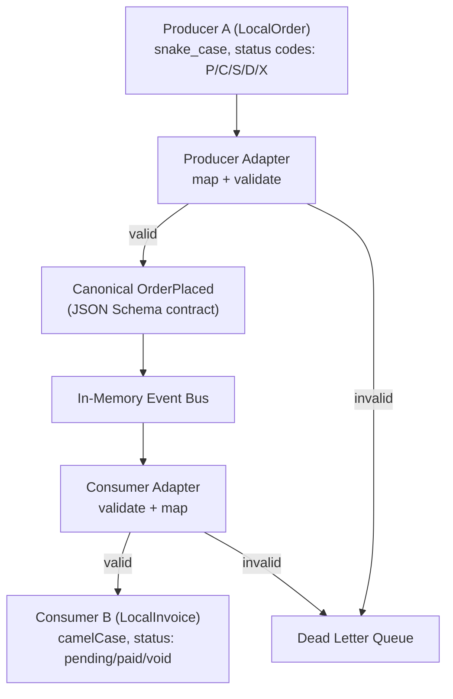

# Canonical Data Model Demo

A practical Node.js/TypeScript demo that teaches **Canonical Data Models** (CDM) as an integration pattern between systems.

## What is a Canonical Data Model?

A canonical data model is a shared, stable representation of a business concept used as the integration "pivot" between systems. Each system maps to/from the canonical model at its boundary via adapters. Systems never depend on each other's internal schemas, they only depend on the canonical contract.

## What This Demo Shows

Two systems with completely different internal models communicate through a canonical `OrderPlaced` event:

- **Producer A** is an e-commerce backend that creates orders using snake_case fields, numeric amounts, single-character status codes, and Unix timestamps.
- **Consumer B** is an invoicing service that needs camelCase fields, a formatted amount string like `"149.99 USD"`, and its own simplified set of invoice statuses (`pending`, `paid`, `void`).

Neither system knows about the other's data shape. They only agree on the canonical contract in between.



### Key patterns demonstrated

- **Adapters as product code**: explicit mapping functions with field renaming, type conversion, enum translation, and structural reshaping
- **Edge validation**: JSON Schema validation happens in the adapter, not deep inside the system
- **Fail fast**: unknown status codes and missing required fields are rejected before hitting the bus
- **DLQ routing**: failed messages go to a dead letter queue with clear reasons
- **Lossy mapping is a feature**: Consumer B deliberately collapses 5 canonical statuses into 3 invoice statuses: that business decision is explicit in the adapter code
- **Schema as source of truth**: the canonical schema is defined in YAML, generates both JSON Schema (for runtime validation) and TypeScript types (for compile-time safety) via `json-schema-to-typescript`
- **Cross-language portability**: the generated JSON Schema can be consumed by any language with a JSON Schema validator

## Project Structure

```
src/
  packages/
    cdm/              # Canonical schema (YAML), generated types + JSON Schema, validators
    event-bus/        # In-memory pub/sub with DLQ
    logging/          # Shared logging utilities
  apps/
    producer-a/       # E-commerce backend: maps LocalOrder -> Canonical
    consumer-b/       # Billing system: maps Canonical -> LocalInvoice
scripts/              # Runnable demo scenarios
```

Each app **owns its adapter**. The team that owns the system is responsible for mapping to/from the canonical model.

**Validators live in the CDM package** for convenience in this demo - TS adapters get validation and types from a single import. In a polyglot or larger setup, the CDM would be schema-only (YAML + generated JSON Schema + generated types per language), and each consumer would bring its own validator (Ajv for TS, `jsonschema` for Python, `gojsonschema` for Go, etc.). Validation setup would live at each consumer's boundary, not in the shared contract.

## Quick Start

```bash
npm install
npm run build:schemas
npm test
```

## Demo Scripts

### Happy path

```bash
npm run demo:happy
```

A valid `LocalOrder` flows through: Producer A maps it to canonical, validation passes, it publishes to the bus, Consumer B receives it, maps to `LocalInvoice`. DLQ stays empty.

### Break currency

```bash
npm run demo:break-currency
```

Producer A emits an order with an empty `currency_code`. The producer adapter catches this via JSON Schema validation (`minLength: 3` on currency) and routes the original message to the DLQ. The message never reaches the bus.

### Break status enum

```bash
npm run demo:break-status
```

Producer A emits an order with status `"R"` (refunded). The producer adapter has no mapping for this code and fails fast before even attempting schema validation. The message goes to the DLQ with a clear error.

## Adapter Mapping Reference

| Dimension | Producer A -> Canonical | Canonical -> Consumer B |
|---|---|---|
| Field names | `order_id` -> `orderId` | `orderId` -> `invoiceRef` |
| Amount | `total_amount` (number) + `currency_code` -> `{ value: "149.99", currency: "USD" }` | `{ value, currency }` -> `"149.99 USD"` |
| Status | `"P"` -> `"placed"` | `"placed"` -> `"pending"` |
| Timestamp | Unix ms -> ISO 8601 | ISO passthrough |
| Failure | Unknown code -> reject | Unknown status -> reject |

## Design Decisions and Tradeoffs

### Amount as decimal string

The canonical `amount.value` is a string (`"149.99"`), not a number. This avoids IEEE 754 floating-point issues (`0.1 + 0.2 !== 0.3`). The schema enforces the format via regex pattern `^\d+\.\d{2}$`. The cost: producers must format, consumers must parse. Worth it for financial data.

### Schema-first types

TypeScript types are generated from the YAML schema using `json-schema-to-typescript`. This means the schema is the single source of truth and types can't drift from the contract. The tradeoff: you need a build step (`npm run build:schemas`), and the generated types aren't as ergonomic as hand-written ones.

### Lossy consumer mapping

Consumer B maps 5 canonical statuses to 3 invoice statuses. This is intentional: not every consumer needs the full fidelity of the canonical model. The adapter makes this business decision explicit and testable rather than hiding it in glue code.

### Where mapping cost lives

All mapping complexity is concentrated in adapters. This is the core tradeoff of CDMs: you pay a per-system adapter cost upfront, but systems stay decoupled. Without a CDM, you'd have N-to-N point-to-point mappings instead of N adapters.

### Versioning approach

The canonical event includes `source.version` metadata. For additive changes (new optional fields), bump the version and update consumers incrementally. For breaking changes (removing fields, changing types), you need a new schema version and a migration strategy. This demo doesn't implement version negotiation but shows where the version info lives so you can build on it.
